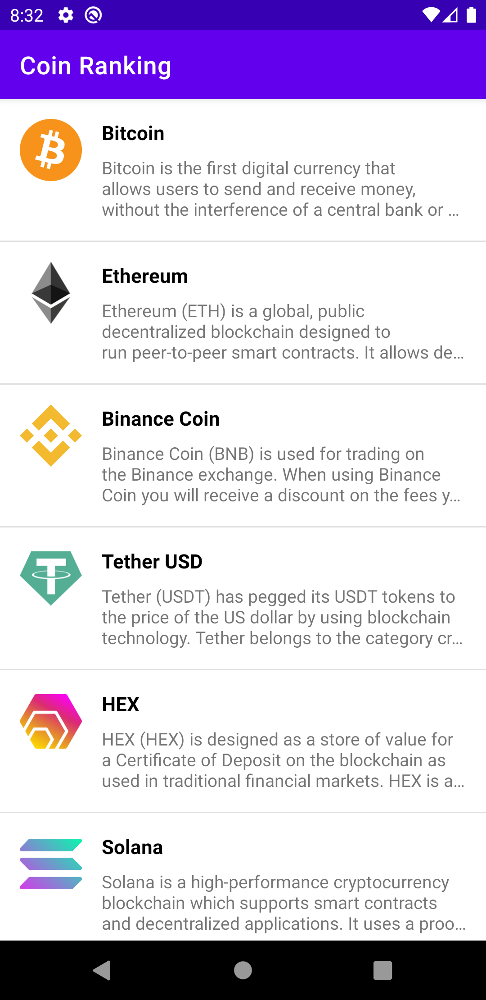

# Coin Ranking

GitHub Repository: [Coin Ranking](https://github.com/nicenicegame/CoinRanking)

## Getting Started

This project uses the Gradle build system. To build this project, use the gradlew build command or use "Import Project" in Android Studio.

## Screenshot

## Libraries Used

- Retrofit + Gson
- Hilt
- Glide